<!-- README.md is generated from README.Rmd. Please edit that file -->


# Alice's Adventures in Wonderland Project

<!-- badges: start -->
<!-- badges: end -->

The goal of Alice's Adventures in Wonderland Project

What is special about using `README.Rmd` instead of just `README.md`? You can include R chunks like so:


```r
summary(cars)
#>      speed           dist       
#>  Min.   : 4.0   Min.   :  2.00  
#>  1st Qu.:12.0   1st Qu.: 26.00  
#>  Median :15.0   Median : 36.00  
#>  Mean   :15.4   Mean   : 42.98  
#>  3rd Qu.:19.0   3rd Qu.: 56.00  
#>  Max.   :25.0   Max.   :120.00
```

You'll still need to render `README.Rmd` regularly, to keep `README.md` up-to-date.

You can also embed plots, for example:

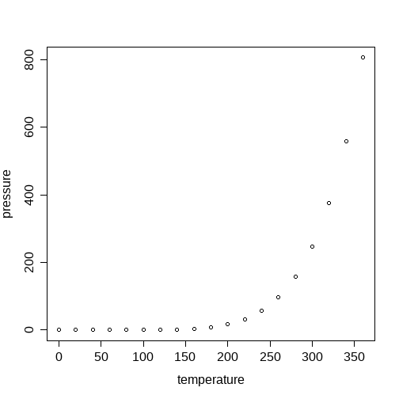

In that case, don't forget to commit and push the resulting figure files, so they display on GitHub.


```
#> Joining with `by = join_by(word)`
#> Error : The fig.showtext code chunk option must be TRUE
#> Warning in grid.Call(C_textBounds, as.graphicsAnnot(x$label), x$x, x$y, : font
#> family not found in Windows font database

#> Warning in grid.Call(C_textBounds, as.graphicsAnnot(x$label), x$x, x$y, : font
#> family not found in Windows font database

#> Warning in grid.Call(C_textBounds, as.graphicsAnnot(x$label), x$x, x$y, : font
#> family not found in Windows font database
```

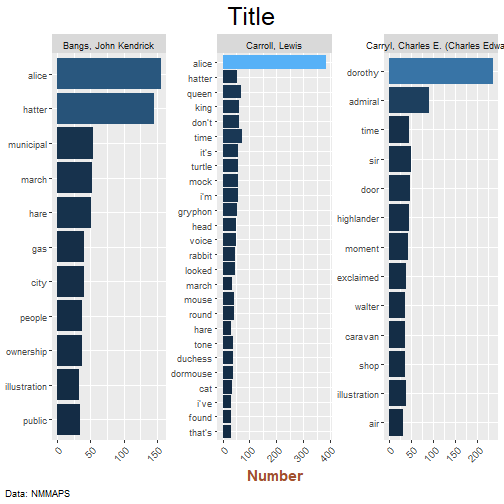


```r
library("gutenbergr")
library("tidytext")
library("tidyverse")
library("ggraph")
library("wordcloud2")
library("thematic")

# 11 Alice's Adventures in Wonderland by Lewis Carroll
# 55040 The Nursery "Alice" by Lewis Carroll

# 58201 The Westminster Alice by Saki
# 28069 Alice in Blunderland: An Iridescent Dream by John Kendrick Bangs
# 25031 Davy and the Goblin by Charles E. Carryl
# 24379 The Admiral's Caravan by Charles E. Carryl
# Alice in Murderland !!!

data(stop_words)

books <- gutenbergr::gutenberg_download(
    c(11, 58201, 28069, 24379),
    mirror = "https://gutenberg.pglaf.org/",
    meta_fields = c("title", "author")
)

books_tidy <-
    books %>%
    group_by(author) %>%
    mutate(
        linenumber = row_number(),
        chapter = cumsum(str_detect(
            text,
            regex("^chapter [\\divxlc]",
            ignore_case = TRUE)
            )
        )
    ) %>%
    ungroup()

books_tidy_tok <-
    books_tidy %>%
    unnest_tokens(word, text) %>%
    anti_join(stop_words) %>%
    filter(chapter > 0) %>%
    group_by(author) %>%
    count(word, sort = TRUE) %>%
    ungroup()
#> Joining with `by = join_by(word)`


thematic_on(
    bg = "#210B34",
    fg = "#80BF38",
    accent = "#B73786",
    font = font_spec("Alice", scale = 1),
    sequential = sequential_gradient(
        fg_low = FALSE,
        fg_weight = 0,
        bg_weight = 1
    ),
    qualitative = circlize::rand_color(5)
)

books_tidy_tok %>%
    filter(n > 30) %>%
    mutate(word = reorder(word, n)) %>%
    ggplot(aes(n, word, fill = n)) +
    geom_col(show.legend = FALSE) +
    facet_wrap(~ author, scales = "free") +
    labs(
        title = "Title",
        x = "Number",
        y = NULL,
        caption = "Data: NMMAPS"
    ) +
    theme(
        axis.title = element_text(color = "sienna", size = 15, face = "bold"),
        axis.text.x = element_text(angle = 45, vjust = 1, hjust = 1, size = 10),
        #strip.background = element_rect(fill = "purple"),
        plot.title = element_text(
            family = "Alice in Wonderland",
            hjust = .5,
            size = 25
        ),
        plot.title.position = "plot",
        plot.caption = element_text(hjust = 0),
        plot.caption.position = "plot"
    ) +
    coord_cartesian(
        expand = TRUE,
        clip = 'off'
    )
#> Error : The fig.showtext code chunk option must be TRUE
#> Warning in grid.Call(C_textBounds, as.graphicsAnnot(x$label), x$x, x$y, : font
#> family not found in Windows font database

#> Warning in grid.Call(C_textBounds, as.graphicsAnnot(x$label), x$x, x$y, : font
#> family not found in Windows font database

#> Warning in grid.Call(C_textBounds, as.graphicsAnnot(x$label), x$x, x$y, : font
#> family not found in Windows font database
```

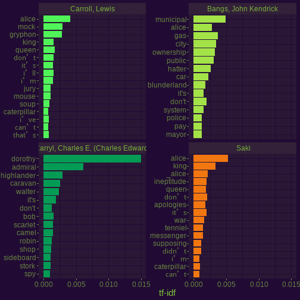

```r

circlize::colorRamp2()
#> Error in circlize::colorRamp2(): argument "breaks" is missing, with no default
circlize::rand_color(2)
#> [1] "#D3EC89FF" "#FEE3C1FF"

books_words <-
    books %>%
    unnest_tokens(word, text) %>%
    count(author, word, sort = TRUE)

books_words <-
    books_words %>%
    bind_tf_idf(word, author, n) %>%
    arrange(desc(tf_idf)) %>%
    mutate(
        author = factor(author, levels = c(
            "Carroll, Lewis",
            "Bangs, John Kendrick",
            "Carryl, Charles E. (Charles Edward)",
            "Saki"
            )
        )
    )

books_words %>%
    group_by(author) %>%
    slice_max(tf_idf, n = 15) %>%
    ungroup() %>%
    mutate(word = reorder(word, tf_idf)) %>%
    ggplot(aes(tf_idf, word, fill = author)) +
    geom_col(show.legend = FALSE) +
    labs(x = "tf-idf", y = NULL) +
    facet_wrap(~ author, ncol = 2, scales = "free_y")
#> Error : The fig.showtext code chunk option must be TRUE
```

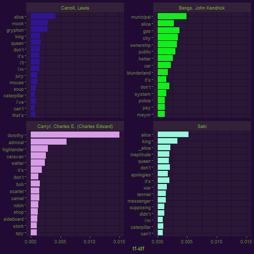

```r

books_tidy_2gm <-
    books_tidy %>%
    unnest_tokens(bigram, text, token = "ngrams", n = 2) %>%
    filter(
        !is.na(bigram)
    ) %>%
    separate(bigram, c("word1", "word2", sep = " ")) %>%
    select(!8) %>%
    filter(
        !word1 %in% stop_words$word,
        !word2 %in% stop_words$word
    )
#> Warning: Expected 3 pieces. Additional pieces discarded in 108 rows [2140,
#> 2229, 2237, 2580, 2581, 2655, 2656, 2658, 2659, 2729, 2730, 4168, 4169, 6832,
#> 6835, 6954, 6955, 8117, 8771, 8772, ...].
#> Warning: Expected 3 pieces. Missing pieces filled with `NA` in 61812 rows [2,
#> 3, 4, 5, 6, 7, 8, 10, 11, 12, 13, 14, 15, 16, 17, 18, 19, 20, 21, 22, ...].

bigram_counts <-
    books_tidy_2gm %>%
    group_by(author) %>%
    count(word1, word2, sort = TRUE) %>%
    ungroup()

books_2gm_unity <-
    books_tidy_2gm %>%
    unite(bigram, word1, word2, sep = " ") %>%
    count(title, bigram, sort = TRUE) %>%
    bind_tf_idf(bigram, title, n)

books_2gm_unity %>%
    arrange(desc(tf_idf)) %>%
    group_by(title) %>%
    slice_max(tf_idf, n = 10) %>%
    ungroup() %>%
    mutate(bigram = reorder(bigram, tf_idf)) %>%
    ggplot(aes(tf_idf, bigram, fill = title)) +
    geom_col(show.legend = FALSE) +
    facet_wrap(~ title, ncol = 2, scales = "free") +
    labs(x = "tf-idf of bigram", y = NULL)
#> Error : The fig.showtext code chunk option must be TRUE
```

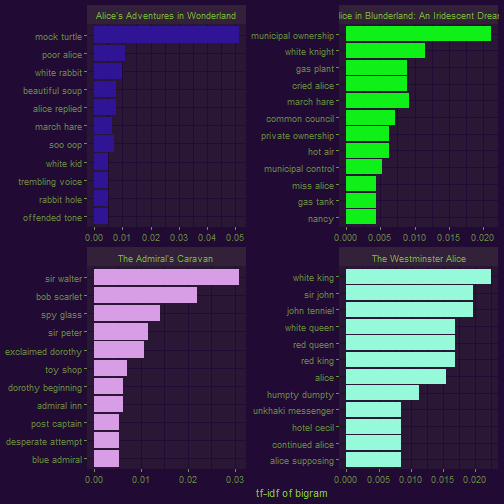

```r

bigram_graph <-
    bigram_counts %>%
    filter(n > 5) %>%
    igraph::graph_from_data_frame()

bigram_graph %>%
    ggraph(layout = "fr") +
    geom_edge_link() +
    geom_node_point() +
    geom_node_text(aes(label = name), vjust = 1, hjust = 1)
#> Error : The fig.showtext code chunk option must be TRUE
```

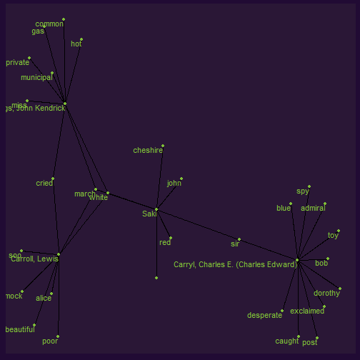

```r

a <- grid::arrow(type = "closed", length = unit(.15, "inches"))

bigram_graph %>%
    ggraph(layout = "fr") +
    geom_edge_link(
        aes(edge_alpha = n), show.legend = FALSE,
        arrow = a, end_cap = circle(.07, 'inches')
    ) +
    geom_node_point(color = "lightblue", size = 5) +
    geom_node_text(aes(label = name), vjust = 1, hjust = 1)
#> Error in y + sin(angles) * r: non-numeric argument to binary operator

book_alice_section <-
    books %>%
    filter(title == "Alice's Adventures in Wonderland") %>%
    mutate(
        chapter = cumsum(str_detect(
            text,
            regex("^chapter [\\divxlc]",
            ignore_case = TRUE)
            )
        )
    ) %>%
    filter(chapter > 0) %>%
    mutate(section = row_number() %/% 5) %>%
    filter(section > 0) %>%
    unnest_tokens(word, text) %>%
    filter(!word %in% stop_words$word)

b_alice_cor <-
    book_alice_section %>%
    widyr::pairwise_count(word, section, sort = TRUE)

b_alice_cor <-
    book_alice_section %>%
    group_by(word) %>%
    filter(n() > 20) %>%
    widyr::pairwise_cor(word, section, sort = TRUE)

b_alice_cor %>%
    filter(item1 %in% c("alice", "march", "rabbit", "mock")) %>%
    group_by(item1) %>%
    slice_max(correlation, n = 6) %>%
    ungroup() %>%
    mutate(item2 = reorder(item2, correlation)) %>%
    ggplot(aes(item2, correlation, fill = correlation)) +
    geom_bar(stat = "identity") +
    facet_wrap(~ item1, scales = "free") +
    labs(
        x = NULL,
        y = NULL
    ) +
    theme(legend.position = "none") +
    coord_flip()
#> Error : The fig.showtext code chunk option must be TRUE
```

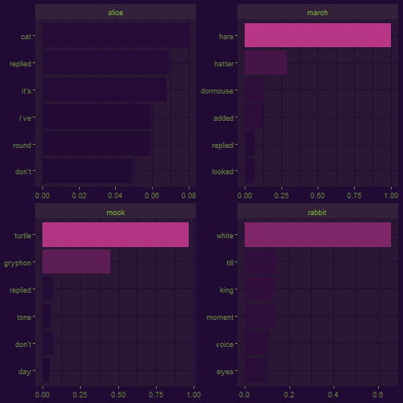

```r

b_alice_cor %>%
    filter(correlation > .3) %>%
    igraph::graph_from_data_frame() %>%
    ggraph(layout = "fr") +
    geom_edge_link(aes(edge_alpha = correlation), show.legend = FALSE) +
    geom_node_point(color = "lightblue", size = 5) +
    geom_node_text(aes(label = name), repel = TRUE)
#> Error : The fig.showtext code chunk option must be TRUE
```

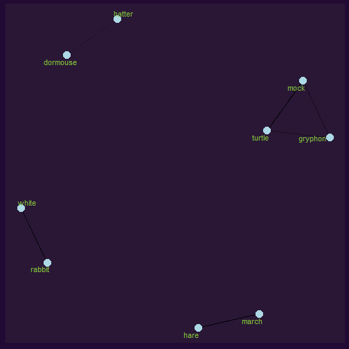

```r

# Sentiment analysis

books_tidy %>%
    unnest_tokens(word, text) %>%
    inner_join(get_sentiments("nrc"), relationship = "many-to-many") %>%
    count(title, index = linenumber %/% 10, sentiment, sort = TRUE) %>%
    pivot_wider(names_from = sentiment, values_from = n, values_fill = 0) %>%
    mutate(sentiment  = (positive + trust + joy + surprise) - (anticipation + negative + disgust + anger + fear + sadness)) %>%
    ggplot(aes(index, sentiment, fill = title)) +
    geom_col(show.legend = FALSE) +
    facet_wrap(~ title, ncol = 2, scales = "free_x")
#> Joining with `by = join_by(word)`
#> Error : The fig.showtext code chunk option must be TRUE
```

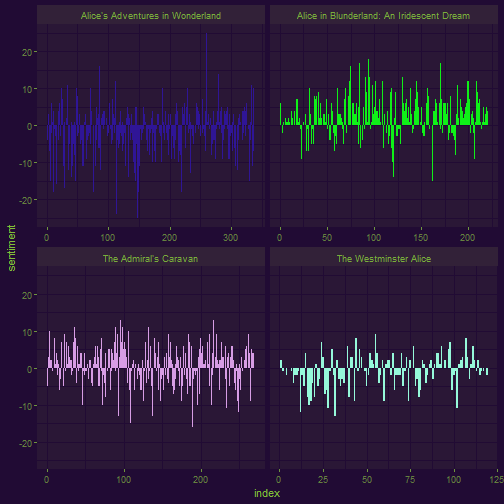

```r

afinn <-
    books_tidy %>%
    filter(title == "Alice's Adventures in Wonderland") %>%
    unnest_tokens(word, text) %>%
    inner_join(get_sentiments("afinn")) %>%
    group_by(index = linenumber %/% 10) %>%
    summarise(sentiment = sum(value)) %>%
    mutate(method = "AFINN")
#> Joining with `by = join_by(word)`

bing_and_nrc <-
    bind_rows(
        books_tidy %>%
        filter(title == "Alice's Adventures in Wonderland") %>%
        unnest_tokens(word, text) %>%
        inner_join(get_sentiments("bing")) %>%
        mutate(method = "BING"),
        books_tidy %>%
        filter(title == "Alice's Adventures in Wonderland") %>%
        unnest_tokens(word, text) %>%
        inner_join(
            get_sentiments("nrc") %>%
            filter(sentiment %in% c("positive", "negative"))
        ) %>%
        mutate(method = "NRC")
    ) %>%
    count(method, index = linenumber %/% 10, sentiment) %>%
    pivot_wider(
        names_from = sentiment,
        values_from = n,
        values_fill = 0
    ) %>%
    mutate(sentiment = positive - negative)
#> Joining with `by = join_by(word)`
#> Joining with `by = join_by(word)`
#> Warning in inner_join(., get_sentiments("nrc") %>% filter(sentiment %in% : Detected an unexpected many-to-many relationship between `x` and `y`.
#> ℹ Row 1732 of `x` matches multiple rows in `y`.
#> ℹ Row 1250 of `y` matches multiple rows in `x`.
#> ℹ If a many-to-many relationship is expected, set `relationship = "many-to-many"` to silence this warning.

bind_rows(
    afinn,
    bing_and_nrc
) %>%
    ggplot(aes(index, sentiment, fill = method)) +
    geom_col(show.legend = FALSE) +
    facet_wrap(~ method, ncol = 1, scales = "free_y")
#> Error : The fig.showtext code chunk option must be TRUE
```

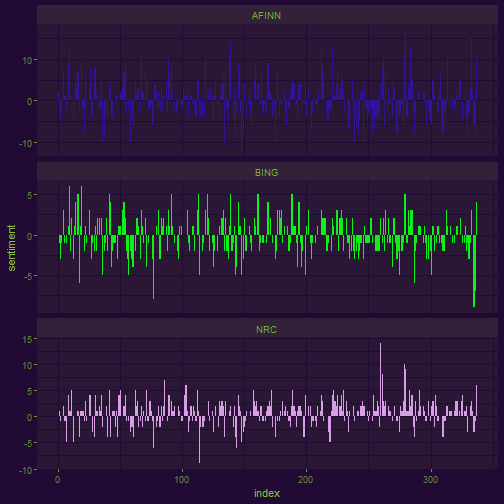

```r

bind_rows(
    afinn,
    bing_and_nrc
) %>%
    ggplot(aes(index, sentiment, fill = method)) +
    geom_col(show.legend = TRUE)
#> Error : The fig.showtext code chunk option must be TRUE
```

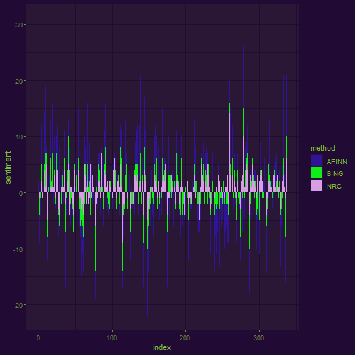

```r

set.seed(2023)
wc <-
    books_tidy %>%
    filter(title == "Alice's Adventures in Wonderland") %>%
    unnest_tokens(word, text) %>%
    anti_join(stop_words) %>%
    filter(chapter > 0) %>%
    count(word, sort = TRUE) %>%
    wordcloud2::wordcloud2(
        figPath = "I:/Downloads/alice-in-wonderland-silhouette-png-1.jpg",
        backgroundColor = "#210B34",
        color = circlize::rand_color(
            n = 2314,
            hue = "orange"
        ),
        fontFamily = "Alice",
        ellipticity = 4,
        size = 0.6
    ) +
    wordcloud2::WCtheme(1)
#> Joining with `by = join_by(word)`
#> Error in wordcloud2::wordcloud2(., figPath = "I:/Downloads/alice-in-wonderland-silhouette-png-1.jpg", : cannot find fig in the figPath

wc <-
    books_tidy %>%
    #filter(title == "Alice's Adventures in Wonderland") %>%
    unnest_tokens(word, text) %>%
    anti_join(stop_words) %>%
    count(title, word, sort = TRUE) %>%
    mutate(per = n/sum(n)) %>%
    filter(n > 50) %>%
    ggplot() +
    geom_text(aes(
        x = word,
        y = per,
        #size = per,
        label = word,
        angle = -45,
        colour = word
        ),
        vjust = -1,
        show.legend = FALSE
    ) +
    facet_wrap(~ title, scales = "free_x") +
    labs(
        y = "Relative Frequency"
    )
#> Joining with `by = join_by(word)`

# Word frequencies

Charles_E <-
    books_tidy %>%
    filter(author == "Carryl, Charles E. (Charles Edward)") %>%
    unnest_tokens(word, text) %>%
    anti_join(stop_words)
#> Joining with `by = join_by(word)`

Carroll_L <-
    books_tidy %>%
    filter(author == "Carroll, Lewis") %>%
    unnest_tokens(word, text) %>%
    anti_join(stop_words)
#> Joining with `by = join_by(word)`

Bangs_J <-
    books_tidy %>%
    filter(author == "Bangs, John Kendrick") %>%
    unnest_tokens(word, text) %>%
    anti_join(stop_words)
#> Joining with `by = join_by(word)`

Saki <-
    books_tidy %>%
    filter(author == "Saki") %>%
    unnest_tokens(word, text) %>%
    anti_join(stop_words)
#> Joining with `by = join_by(word)`

frequency <-
    bind_rows(
        mutate(Charles_E, author = "Charles Edward"),
        mutate(Carroll_L, author = "Lewis Carroll"),
        mutate(Bangs_J, author = "John Kendrick Bangs"),
        mutate(Saki, author = "Saki")
    ) %>%
    mutate(word = str_extract(word, "[a-z']+")) %>%
    count(author, word) %>%
    group_by(author) %>%
    mutate(proportion = n / sum(n)) %>%
    select(-n) %>%
    pivot_wider(names_from = author, values_from = proportion) %>%
    pivot_longer(
        `Charles Edward` | `John Kendrick Bangs` | Saki,
        names_to = "author", values_to = "proportion"
    )

frequency %>%
    ggplot(aes(
        x = proportion, y = `Lewis Carroll`,
        colour = abs(`Lewis Carroll` - proportion)
        )
    ) +
    geom_abline(color = "gray40", lty = 2) +
    geom_jitter(alpha = 0.1, size = 2.5, width = 0.3, height = 0.3) +
    geom_text(aes(label = word), check_overlap = TRUE, vjust = 1.5) +
    scale_x_log10(labels = scales::percent_format()) +
    scale_y_log10(labels = scales::percent_format()) +
    facet_wrap(~ author, ncol = 2, scales = "free_y") +
    labs(y = "Lewis Carroll", x = NULL) +
    theme(legend.position = "none")
#> Error : The fig.showtext code chunk option must be TRUE
#> Warning: Removed 15439 rows containing missing values (`geom_point()`).
#> Warning: Removed 15442 rows containing missing values (`geom_text()`).
```

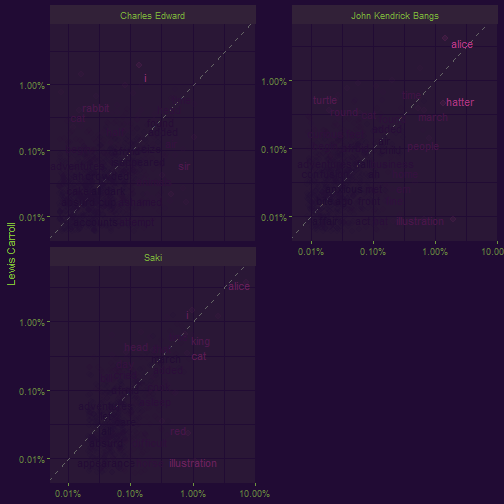

```r

cor.test(
    data = frequency[frequency$author == "John Kendrick Bangs", ],
    ~ proportion + `Lewis Carroll`
)
#> 
#> 	Pearson's product-moment correlation
#> 
#> data:  proportion and Lewis Carroll
#> t = 24.68, df = 687, p-value < 2.2e-16
#> alternative hypothesis: true correlation is not equal to 0
#> 95 percent confidence interval:
#>  0.6438018 0.7231913
#> sample estimates:
#>       cor 
#> 0.6855291

books_tidy %>%
    filter(title == "Alice's Adventures in Wonderland") %>%
    unnest_tokens(sentences, text, token = "sentences") %>%
    filter(chapter > 0) %>%
    sentimentr::get_sentences(sentences) %>%
    sentimentr::sentiment(
        valence_shifters_dt = lexicon::hash_valence_shifters[y == 4]
    ) %>%
    ggplot(aes(x = element_id, y = sentiment, colour = sentiment)) +
    geom_segment(aes(
        xend = element_id,
        y = 0,
        yend = sentiment
        ),
        alpha = 0.9
    ) +
    geom_point() +
    labs(
        x = "Sentence",
        y = "Sentiment"
    ) +
    theme(legend.position = "none")
#> Error : The fig.showtext code chunk option must be TRUE
```

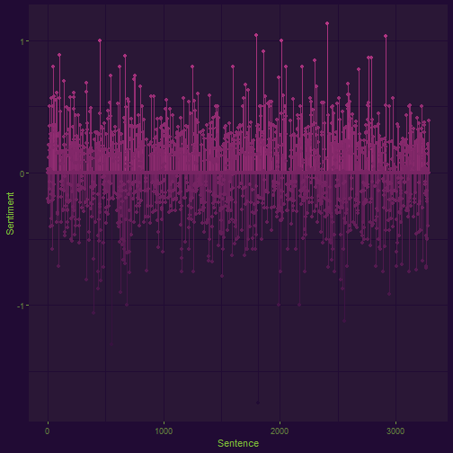

```r

# Venn and UpSetR plots

library("ggVennDiagram")
library("ComplexUpset")

venn_data <-
    books_tidy %>%
    unnest_tokens(word, text, token = "words") %>%
    anti_join(stop_words) %>%
    select(title, author, word)
#> Joining with `by = join_by(word)`

Lew_Car <-
    venn_data %>%
    filter(title == "Alice's Adventures in Wonderland")

Bangs <-
    venn_data %>%
    filter(title == "Alice in Blunderland: An Iridescent Dream")

Carr_Ed <-
    venn_data %>%
    filter(title == "The Admiral's Caravan")

Saki_V <-
    venn_data %>%
    filter(title == "The Westminster Alice")


venn_data_v <- list(
    A = Lew_Car$word,
    B = Bangs$word,
    C = Carr_Ed$word,
    D = Saki_V$word
)

names(venn_data_v)
#> [1] "A" "B" "C" "D"

library("thematic")

thematic_on(
  bg = "auto", fg = "auto", accent = "auto", font = NA,
  sequential = sequential_gradient(), qualitative = okabe_ito()
)


ComplexUpset::upset(
    UpSetR::fromList(venn_data_v),
    intersect = names(UpSetR::fromList(venn_data_v)),
    wrap = TRUE
) +
labs(
    x = "Authors"
)
```

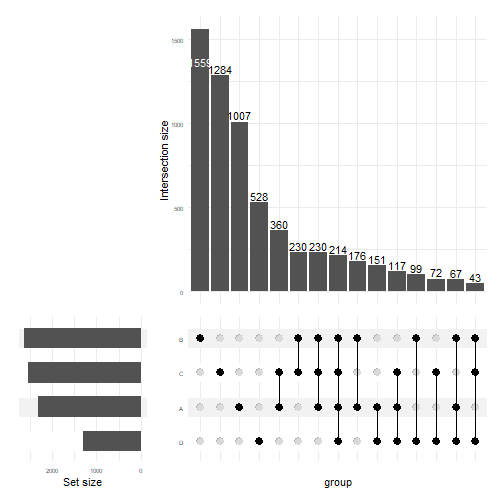

```r

testt <- venn_data_v %>%
    ggVennDiagram(
        show_intersect = FALSE,
        label = "count",
        label_geom = "label"
    ) +
    paletteer::scale_fill_paletteer_c("ggthemes::Sunset-Sunrise Diverging") +
    labs(
        title = "Venn Plot",
        subtitle = "generated by `ggVennDiagram`"
    ) +
    theme(legend.position = "none")
```
