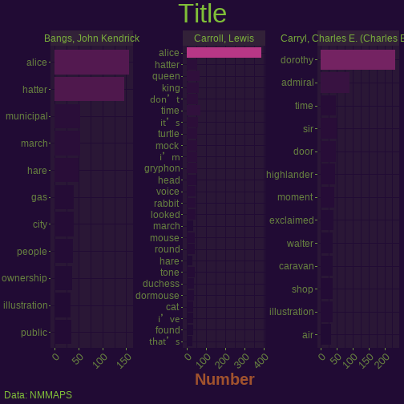
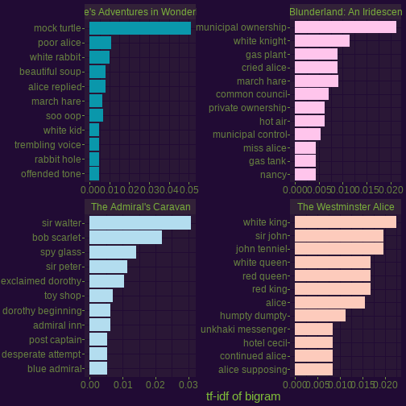
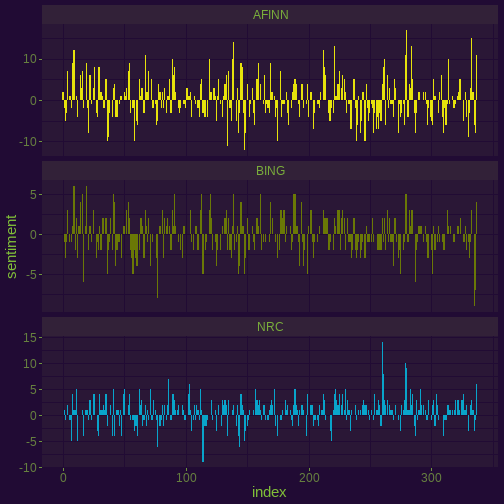

<!-- README.md is generated from README.Rmd. Please edit that file -->


# Alice's Adventures in Wonderland Project

<!-- badges: start -->
<!-- badges: end -->

The goal of Alice's Adventures in Wonderland Project

What is special about using `README.Rmd` instead of just `README.md`? You can include R chunks like so:


```r
summary(cars)
#>      speed           dist       
#>  Min.   : 4.0   Min.   :  2.00  
#>  1st Qu.:12.0   1st Qu.: 26.00  
#>  Median :15.0   Median : 36.00  
#>  Mean   :15.4   Mean   : 42.98  
#>  3rd Qu.:19.0   3rd Qu.: 56.00  
#>  Max.   :25.0   Max.   :120.00
```

You'll still need to render `README.Rmd` regularly, to keep `README.md` up-to-date.

You can also embed plots, for example:


In that case, don't forget to commit and push the resulting figure files, so they display on GitHub.


```
#> Joining with `by = join_by(word)`
#> Error : The fig.showtext code chunk option must be TRUE
#> Warning in grid.Call(C_textBounds, as.graphicsAnnot(x$label), x$x, x$y, : font
#> family 'Alice in Wonderland' not found, will use 'sans' instead

#> Warning in grid.Call(C_textBounds, as.graphicsAnnot(x$label), x$x, x$y, : font
#> family 'Alice in Wonderland' not found, will use 'sans' instead

#> Warning in grid.Call(C_textBounds, as.graphicsAnnot(x$label), x$x, x$y, : font
#> family 'Alice in Wonderland' not found, will use 'sans' instead

#> Warning in grid.Call(C_textBounds, as.graphicsAnnot(x$label), x$x, x$y, : font
#> family 'Alice in Wonderland' not found, will use 'sans' instead

#> Warning in grid.Call(C_textBounds, as.graphicsAnnot(x$label), x$x, x$y, : font
#> family 'Alice in Wonderland' not found, will use 'sans' instead

#> Warning in grid.Call(C_textBounds, as.graphicsAnnot(x$label), x$x, x$y, : font
#> family 'Alice in Wonderland' not found, will use 'sans' instead

#> Warning in grid.Call(C_textBounds, as.graphicsAnnot(x$label), x$x, x$y, : font
#> family 'Alice in Wonderland' not found, will use 'sans' instead

#> Warning in grid.Call(C_textBounds, as.graphicsAnnot(x$label), x$x, x$y, : font
#> family 'Alice in Wonderland' not found, will use 'sans' instead

#> Warning in grid.Call(C_textBounds, as.graphicsAnnot(x$label), x$x, x$y, : font
#> family 'Alice in Wonderland' not found, will use 'sans' instead

#> Warning in grid.Call(C_textBounds, as.graphicsAnnot(x$label), x$x, x$y, : font
#> family 'Alice in Wonderland' not found, will use 'sans' instead
#> Warning in grid.Call.graphics(C_text, as.graphicsAnnot(x$label), x$x, x$y, :
#> font family 'Alice in Wonderland' not found, will use 'sans' instead

#> Warning in grid.Call.graphics(C_text, as.graphicsAnnot(x$label), x$x, x$y, :
#> font family 'Alice in Wonderland' not found, will use 'sans' instead
```



Blah Blah


```
#> Error : The fig.showtext code chunk option must be TRUE
```


adwwadwad


```
#> Warning: Expected 3 pieces. Additional pieces discarded in 108 rows [2140,
#> 2229, 2237, 2580, 2581, 2655, 2656, 2658, 2659, 2729, 2730, 4168, 4169, 6832,
#> 6835, 6954, 6955, 8117, 8771, 8772, ...].
#> Warning: Expected 3 pieces. Missing pieces filled with `NA` in 61812 rows [2,
#> 3, 4, 5, 6, 7, 8, 10, 11, 12, 13, 14, 15, 16, 17, 18, 19, 20, 21, 22, ...].
#> Error : The fig.showtext code chunk option must be TRUE
```



awdwad


```
#> Joining with `by = join_by(word)`
#> Warning: Expected 3 pieces. Additional pieces discarded in 108 rows [2140,
#> 2229, 2237, 2580, 2581, 2655, 2656, 2658, 2659, 2729, 2730, 4168, 4169, 6832,
#> 6835, 6954, 6955, 8117, 8771, 8772, ...].
#> Warning: Expected 3 pieces. Missing pieces filled with `NA` in 61812 rows [2,
#> 3, 4, 5, 6, 7, 8, 10, 11, 12, 13, 14, 15, 16, 17, 18, 19, 20, 21, 22, ...].
#> IGRAPH eaa728b DN-- 33 40 -- 
#> + attr: name (v/c), word2 (e/c), n (e/n)
#> + edges from eaa728b (vertex names):
#>  [1] Carroll, Lewis                     ->mock     
#>  [2] Bangs, John Kendrick               ->march    
#>  [3] Carryl, Charles E. (Charles Edward)->sir      
#>  [4] Carroll, Lewis                     ->march    
#>  [5] Bangs, John Kendrick               ->white    
#>  [6] Carryl, Charles E. (Charles Edward)->bob      
#>  [7] Bangs, John Kendrick               ->municipal
#>  [8] Bangs, John Kendrick               ->cried    
#> + ... omitted several edges
#> Error : The fig.showtext code chunk option must be TRUE
```


awdwad


```
#> Joining with `by = join_by(word)`
#> Warning: Expected 3 pieces. Additional pieces discarded in 108 rows [2140,
#> 2229, 2237, 2580, 2581, 2655, 2656, 2658, 2659, 2729, 2730, 4168, 4169, 6832,
#> 6835, 6954, 6955, 8117, 8771, 8772, ...].
#> Warning: Expected 3 pieces. Missing pieces filled with `NA` in 61812 rows [2,
#> 3, 4, 5, 6, 7, 8, 10, 11, 12, 13, 14, 15, 16, 17, 18, 19, 20, 21, 22, ...].
#> Error in y + sin(angles) * r: non-numeric argument to binary operator
```

awdwadwad


```
#> Joining with `by = join_by(word)`
#> Warning: Expected 3 pieces. Additional pieces discarded in 108 rows [2140,
#> 2229, 2237, 2580, 2581, 2655, 2656, 2658, 2659, 2729, 2730, 4168, 4169, 6832,
#> 6835, 6954, 6955, 8117, 8771, 8772, ...].
#> Warning: Expected 3 pieces. Missing pieces filled with `NA` in 61812 rows [2,
#> 3, 4, 5, 6, 7, 8, 10, 11, 12, 13, 14, 15, 16, 17, 18, 19, 20, 21, 22, ...].
#> Error : The fig.showtext code chunk option must be TRUE
```


```
#> Error : The fig.showtext code chunk option must be TRUE
```


awdawda


```
#> Joining with `by = join_by(word)`
#> Warning: Expected 3 pieces. Additional pieces discarded in 108 rows [2140,
#> 2229, 2237, 2580, 2581, 2655, 2656, 2658, 2659, 2729, 2730, 4168, 4169, 6832,
#> 6835, 6954, 6955, 8117, 8771, 8772, ...].
#> Warning: Expected 3 pieces. Missing pieces filled with `NA` in 61812 rows [2,
#> 3, 4, 5, 6, 7, 8, 10, 11, 12, 13, 14, 15, 16, 17, 18, 19, 20, 21, 22, ...].
#> Error : The fig.showtext code chunk option must be TRUE
```


adwwadwad


```
#> Joining with `by = join_by(word)`
#> Error : The fig.showtext code chunk option must be TRUE
```


awdwad


```
#> Joining with `by = join_by(word)`
#> Error : The fig.showtext code chunk option must be TRUE
```


```
#> Joining with `by = join_by(word)`
#> Joining with `by = join_by(word)`
#> Joining with `by = join_by(word)`
#> Warning in inner_join(., get_sentiments("nrc") %>% filter(sentiment %in% : Detected an unexpected many-to-many relationship between `x` and `y`.
#> ℹ Row 1732 of `x` matches multiple rows in `y`.
#> ℹ Row 1250 of `y` matches multiple rows in `x`.
#> ℹ If a many-to-many relationship is expected, set `relationship = "many-to-many"` to silence this warning.
#> Error : The fig.showtext code chunk option must be TRUE
```



```
#> Error : The fig.showtext code chunk option must be TRUE
```


awdwadwad


```
#> Joining with `by = join_by(word)`
#> PhantomJS not found. You can install it with webshot::install_phantomjs(). If it is installed, please make sure the phantomjs executable can be found via the PATH variable.
#> Error in path.expand(path): invalid 'path' argument
#> Joining with `by = join_by(word)`
#> Error : The fig.showtext code chunk option must be TRUE
```


awdwadwad


```
#> Joining with `by = join_by(word)`
#> Joining with `by = join_by(word)`
#> Joining with `by = join_by(word)`
#> Joining with `by = join_by(word)`
#> Error : The fig.showtext code chunk option must be TRUE
#> Warning: Removed 15439 rows containing missing values (`geom_point()`).
#> Warning: Removed 15442 rows containing missing values (`geom_text()`).
```


```
#> 
#> 	Pearson's product-moment correlation
#> 
#> data:  proportion and Lewis Carroll
#> t = 24.68, df = 687, p-value < 2.2e-16
#> alternative hypothesis: true correlation is not equal to 0
#> 95 percent confidence interval:
#>  0.6438018 0.7231913
#> sample estimates:
#>       cor 
#> 0.6855291
#> Error : The fig.showtext code chunk option must be TRUE
```


awdwadwad


```
#> Joining with `by = join_by(word)`
```


Blah-blah

